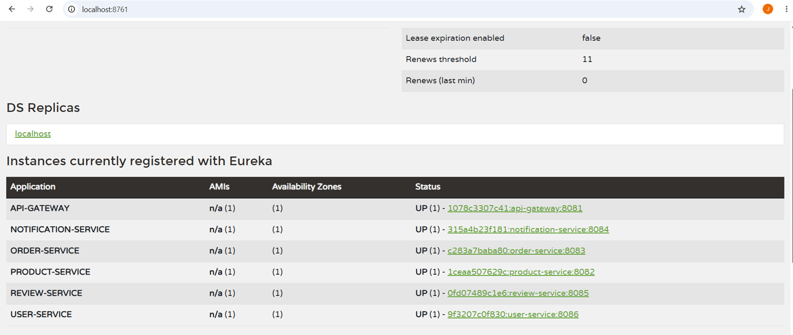
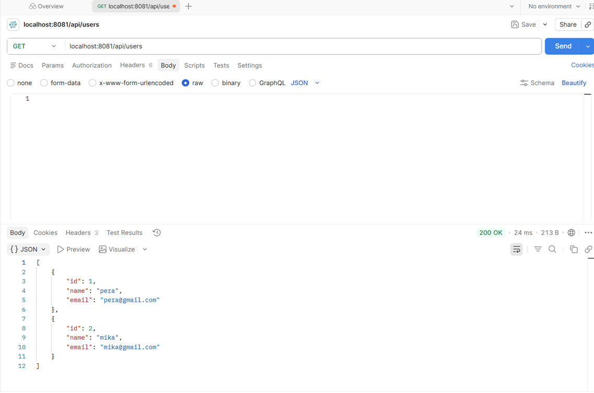
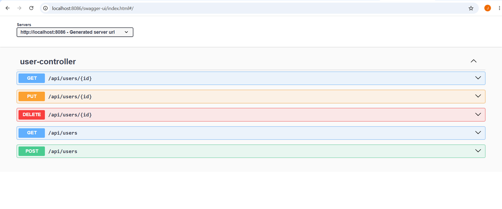
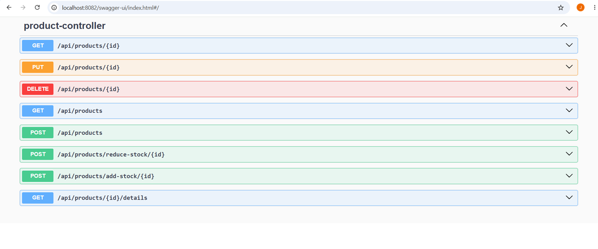
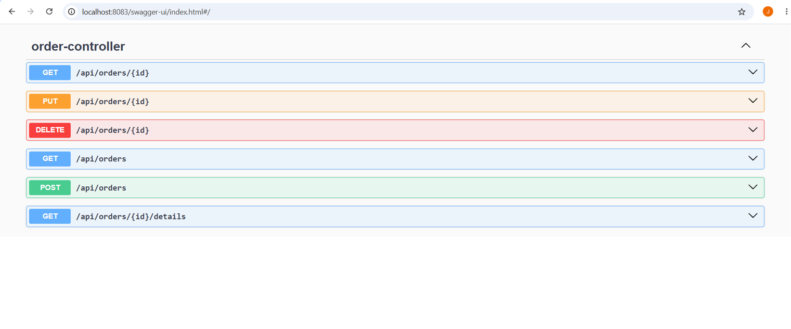
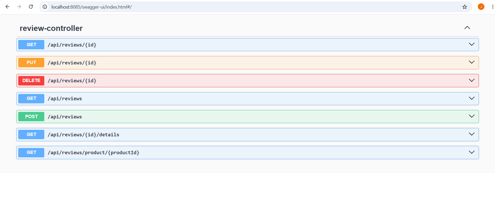
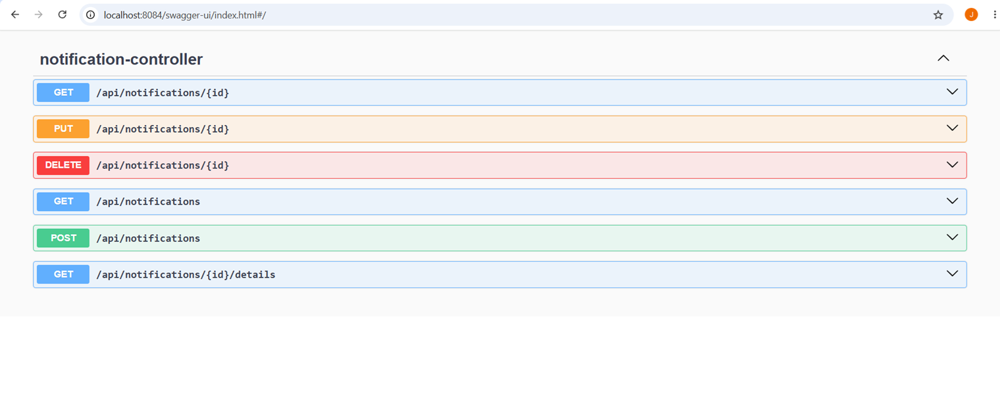
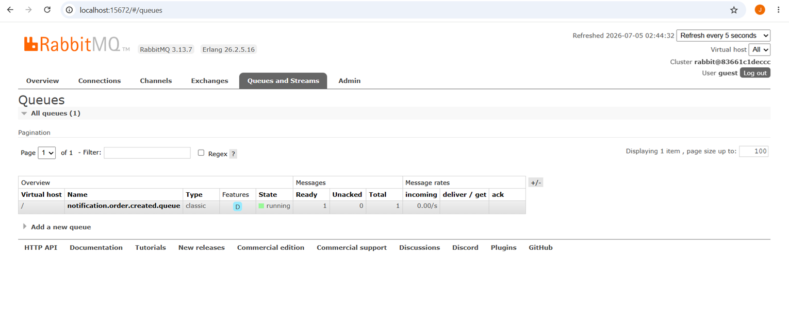

# Mini E-commerce mikroservisi sa Spring Cloud-om

Projekat iz Programiranja distribuiranih sistema - Mikroservisna aplikacija koja demonstrira
principe modernog distribuiranog sistema u Javi sa Spring Boot-om: razdvajanje na servise, sinhrona komunikacija preko OpenFeign-a, dinamičko pronalaženje servisa kroz Eureka-u, kontrolisan ulaz kroz API Gateway, load balancing, otpornost na greške (Resilience4j) ,asinhrona komunikaciju preko RabbitMQ-a, Docker kontejnerizacija i globalni exception handling kroz @RestControllerAdvice.

## Izabrana tema

**Mini e-commerce**: User, Product, Order, Review, Notification.

## Struktura repozitorijuma

```
pds/
├── docker-compose.yml
├── eureka-discovery-server/
├── api-gateway/
├── user-service/
├── product-service/
├── order-service/
├── review-service/
└── notification-service/
```

## Tehnologije

| Kategorija | Tehnologija |
|---|---|
| Framework | Spring Boot 3.4.1, Spring Cloud 2024.0.1 |
| Service Discovery | Netflix Eureka |
| API Gateway | Spring Cloud Gateway |
| Sinhrona komunikacija | OpenFeign |
| Otpornost na greške | Resilience4j (Circuit Breaker + Retry) |
| Asinhrona komunikacija | RabbitMQ (Spring AMQP) |
| Baza podataka | H2 (in-memory) |
| ORM | Spring Data JPA |
| Validacija | Jakarta Bean Validation |
| Dokumentacija API-ja | springdoc-openapi / Swagger UI |
| Monitoring | Spring Boot Actuator |
| Kontejnerizacija | Docker, Docker Compose |

## Pokretanje projekta

### Preduslovi

- **Docker Desktop** (pokrenut) — preporučeni način pokretanja
- (opciono, za lokalno pokretanje bez Dockera, ne preporučuje se) Java 17 + Maven

### Pokretanje — Docker Compose (preporučeno)

```bash
git clone <link-ka-repozitorijumu>
cd pds
docker compose up --build
```

Prvo pokretanje traje nekoliko minuta (Maven skida zavisnosti). Svaki naredni put dovoljno
je:

```bash
docker compose up
```

### Gašenje sistema

```bash
docker compose down
```

### Provera

1. Otvoriti `http://localhost:8761` — svih 6 servisa (5 poslovnih + gateway) treba da bude vidljivo sa
   statusom `UP`.
2. Otvoritu Swagger UI bilo kog servisa i isprobati endpoint-e.


### Portovi i UI

| Servis | Port | UI |
|---|---|---|
| Eureka Discovery Server | 8761 | http://localhost:8761 (dashboard) |
| API Gateway | 8081 | / |
| User Service | 8086 | http://localhost:8086/swagger-ui.html |
| Product Service | 8082 | http://localhost:8082/swagger-ui.html |
| Order Service | 8083 | http://localhost:8083/swagger-ui.html |
| Review Service | 8085 | http://localhost:8085/swagger-ui.html |
| Notification Service | 8084 | http://localhost:8084/swagger-ui.html |
| RabbitMQ Management | 15672 | http://localhost:15672 (guest / guest) |

## Skrinšotovi

### Eureka Dashboard — svi servisi registrovani


### API gateway — primer GET zahteva ka `user-service` 


### Swagger UI — User Service


### Swagger UI — Product Service


### Swagger UI — Order Service


### Swagger UI — Review Service


### Swagger UI — Notification Service


### RabbitMQ — poruka u redu

